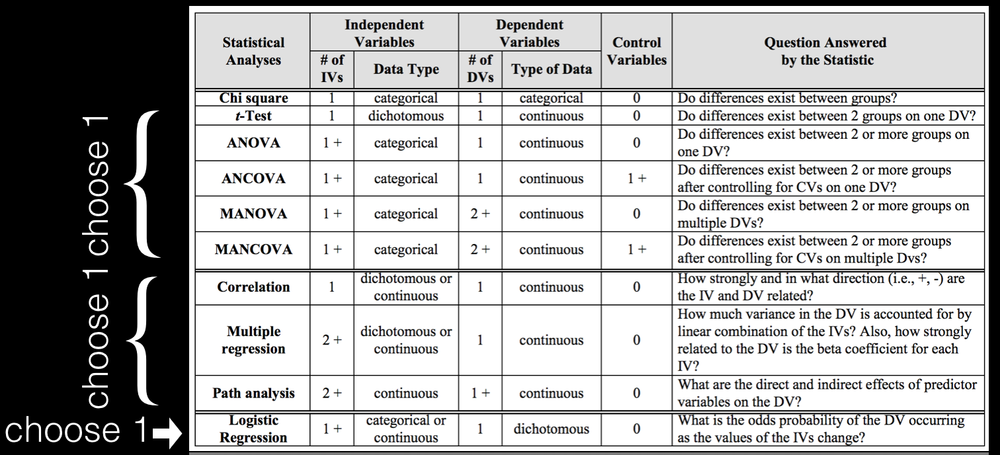
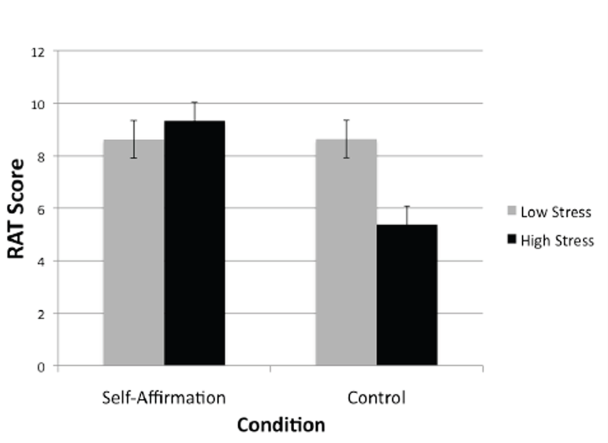

# PUI2018 HW 5 session 1 (mornings).

## ASSIGNED READING:

[Estimating the Reproducibility of Social Sciences](http://www.sciencemag.org/content/349/6251/aac4716.full.pdf) Open Science Collaboration, 2015 **Note: because it is a Science magazene paper, you can only access it for free from the NYU internet connection!**

This is a seminal paper that initiated a number of efforts to increase reproducibility and support open science (e.g. the [COS](https://centerforopenscience.org/))

How to read a scientific paper: you do not need to read all of it (generally scientists don't unless the paper is directly connected with their research.)
On a journal like science the front page of the article is a synapsis of it. Read that (mandatory). Then go to the body of the article and read:
Abstract (mandatory), Introduction (you can skip it if you think the front page gave you sufficient understanding), 
Tables and Table captions (mandatory), Figures and Figure captions (mandatory), Conclusions (mandatory). 
_You are responsible for reading **and understanding** the content of the reading material_. If anything is not clear, because of language difficulties or any other reason, please ask!

## ASSIGNMENTS:

### Submission Info:

For Assignment 1: work alone. 

For Assignment 2: work in groups of 2. Strictly no more than 3!

For the rest of the HW you can work in groups of up to 5 as usual, and you are encouraged to. 
Create a HW5\_\<nyuID\> directory in your PUI2018\_\<nyuID\> repository. 
Include a README.md that briefly summarizes the scope of the homework (so we know you understand what you did), 
and states with whome you worked and what you specifically contributed to. 

Submit __Assignment 1__ as a pull request markdown file to be added to your classmate repository (see below), 

Submit __Assignment 2__ by including your 3 tables (see below) in the README for the directory  into your PUI2018_\<netID\>/HW5_\<netID\> repository. 

Submit __Assignment 3__ and __Assignment 4__ as separate notebooks as usual. 

**There is a lot of homework this week! dont wait until the last minute to start!**]
Keep in mind that we will look for possible cases of plagiarism, 
and if the code appears too similar to that of people that you did not work with to be original work 
(there are automated ways to look for plagiarism in code) you will be penalized.

## Assignment 1: Review your classmate's Citibike project proposal

You will recieve an email tonight with the name, nyuID, and GitHub username of two classmate. 

1. check that at least one of these class-mates is not already in your group for HW4 and contact me **promptly** if they both are! By lunch time tomorrow I want to do the necessary reassignments so that each of you is paired with a classmate so I need to know ASAP.

2. look in the classmate HW4\_\<netid\> repo ASAP and identify their submission for the citibike project. If you cannot find it contact them immediately! 

3. Fork their repository and clone it (you did this in HW1, look at the instructions in  the HW1 [README](https://github.com/fedhere/PUI2018_fb55/blob/master/HW1_fb55/README.md) if you need to refresh your memory) - only read up to the experimantal setup and verify the data to answer the question is available. Do not consider the way they answer the question if they already did!

4. Read it carefully (but do not modify the notebook)! You have to:
  
  a. verify that their Null and alternative hypotheses are formulated correctly
  
  b. verify that the data supports the project: i.e. if the a data has the appropriate features (variables) to answer the question, and if the data was properly pre-processed to extract the needed values (there is some flexibility here since the test was not chosen yet)
  
  c. chose an appropriate test to test _H0_ given the type of data, and the question asked.  You can refer to the flowchart of statistical tests for this in the slides, or [here](https://www.ncbi.nlm.nih.gov/pmc/articles/PMC3116565/), or Statistics in a Nutshell.
  
5. Write  your comments, suggestions, and suggested an appropriate statistical test, motivating your test choice, in a markdown **named CitibikeReview\_\<netID\>.md**. Suggest variations on the question, if you think it may be made more interesting.

6. Submit a pull request to the original repository.

### Grading: 

you will be graded on the validity and depth of your review. 50% of the grade will be on the feedback on the research plan. Be thorough (without being offensive of course in your feedback: constructive rather than distructive feedback!). 50% will be on the suggested test: if it is the incorrect test you will loose points. However, if you motivate rationally your choice, you may get partial credit even if the test is not the best choice. **Notice: I will be grading these assignments, not the TAs**. 

## Assignment 2: Literature choices of statistical tests

Work with one, or maximum two people. 

Choose three tests from the table in the slides 

one in the top potrion of the chart (chi-sq, t-test, and the ANOVA family of tests) where you are looking for differences between groups, and one in the bottom portion where you are looking for relationships bewteen the dependent and independent variables (correlation, regression, path analysis), and a logistic regression.

Go to the main web page of the journal [PLOS ONE](http://journals.plos.org/plosone/) and search for articles that use that test (**DO NOT USE THE ARTICLE I USED FOR THE CLASS EXAMPLE:** http://journals.plos.org/plosone/article?id=10.1371/journal.pone.0062593).

Put the name of your tests (one by one) in the search (you can also use the advanced search) and choose a paper that uses the test you selected. Read the relevant portions of the paper (the abstract, and then a search for occurrences of the test name may be sufficient!) and identify what are the Dependent Variables (DV), Independent Variables (IV), and, if applicable, control variables (remember class 2 slides if you forgot), how many they are, and what type they are (categorical, continuous...). 

Write out the number of DV, type of DV, number of IV, type of IV, number of control variables, kind of questions as a [table](https://github.com/adam-p/markdown-here/wiki/Markdown-Cheatsheet#tables) in your README.md file, filling in the same fields as in the first table in the literature about ["When to use what test?"](https://www.ncbi.nlm.nih.gov/pmc/articles/PMC3116565/). 

This is a template for the table. To see how it is written clock on the Raw link to see this README.md in its raw unrendered format.

| **Statistical Analyses**	|  **IV(s)**  |  **IV type(s)** |  **DV(s)**  |  **DV type(s)**  |  **Control Var** | **Control Var type**  | **Question to be answered** | **_H0_** | **alpha** | **link to paper**| 
|:----------:|:----------|:------------|:-------------|:-------------|:------------|:------------- |:------------------|:----:|:-------:|:-------|
ANCOVA	| 1, Ranks of values | ordinal | 1, did Self Affirmation or no| categorical | 1, age | continuous (could also be categorical) | 	Do participants in self-affirmation rak  value significantly higher than control group | Ranks test groups <= Ranks control group | 0.05 | [Self-Affirmation Improves Problem-Solving under Stress](http://journals.plos.org/plosone/article?id=10.1371/journal.pone.0062593) |
  |||||||||
  
  
  Include the main plot of the paper (the plot that summarized the result)
  

### GRADING: 

Your HW5\_\<netID\> README.md should show, in addition to the usual items (the scope of the homework, the group partecipants, your role in the group work) a two-row tables like the one above explaining the use of two tests in papers published in PLOS One.

## Assignment 3: Reproduce the analysis of the Hard to Employ program in NY:

Reproduce the analysis of the Hard to Employ programs for NY. You may want to read the relevant portion of the study to make sure you are not just workign mechanically (Chapter 2 of the [original document](http://www.mdrc.org/sites/default/files/What%20Strategies%20Work%20for%20the%20Hard%20FR.pdf)).

Reproduce the results in cell 2 of Table 2.1 (_Ever employed in a CEO transitional job_), and cell 10 (_Convicted of a felony_). Fill in the cells of the scheleton [notebook](https://github.com/fedhere/PUI2017_fb55/blob/master/Lab4_fb55/effectivenes%20of%20NYC%20Post-Prison%20Employment%20Programs.ipynb) as you are asked to.

Turn in your version of the python notebook in the HW5_\<netID\> directory

### Grading 

All cells that are marked "for you to do" (or similar...) and that contain missing values should be filled.

The second null hypothesis should be stated (for the "Convicted of a felony after 3 years" data).

Both tests, Z and chi-sq, should be completed for the "Convicted of a felony after 3 years" data.

The result of the test in term the rejection of the Null should be stated in all cases (for both tests and both for the original "Ever employed in a CEO transitional job" data and the "Convicted of a felony after 3 years data").

## Assignment 4: Tests of correlation using the scipy package with citibike data.

Use the following are 3 tests to assess correlation between 2 samples of citibike data:
- Pearson’s test 
- Spearman’s test 
- K-S test

There is a skeleton notebook that works on a similar question, age of male vs female riders. Follow it to see how to set up the assignment [notebook citibikes_compare_distributions.ipynb](https://github.com/fedhere/PUI2017_fb55/blob/master/HW4_fb55/citibikes_compare_distributions.ipynb). 

Use: trip duration of bikers that ride during the day vs night. State your result in words in terms of the Null Hypothesis

Use: age of bikers for trips originating in Manhattan and in Brooklyn. Use at least 2 months of citibike data. The citibike data can be accessed from the [citibike website](https://www.citibikenyc.com/system-data) - make sure you do it in a reproducible way, or in the CUSP data facility at the path /gws/open/Student/citibike

### Grading 

A notebook should be completed as the cell by cell instructions indicate.

You must state the Null Hypothesis, according to what you know about the test and the **scipy.stats** package documentation **for three scipy.stats function**, corresponding to the three tests.

You must put the caluclated statistics and the p-value in the context of null hypothesis rejection in each case.
